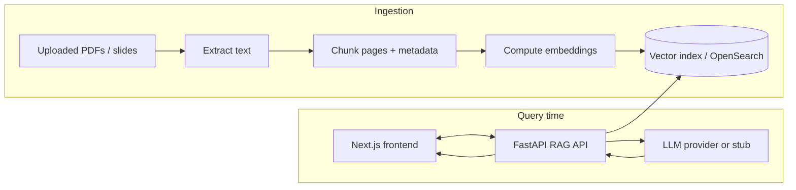

# EduRAG — AI study companion grounded in your course content

EduRAG is a Retrieval-Augmented Generation (RAG) study assistant: it ingests course materials (slides, PDFs, syllabi), indexes them semantically, and answers questions with citations back to the original content.

This documentation site is the hub for understanding, running, and extending EduRAG.

## What is EduRAG?

EduRAG is a scaffolded platform rather than a closed product. Out of the box it gives you:

- A **FastAPI backend** that handles ingestion, vector search, and RAG answer generation.
- A **Next.js frontend** that lets users chat with their course content and see citations.
- **Infrastructure scaffolding** (Terraform, Docker Compose) for OpenSearch, S3-like storage, and AWS integration.
- A **test suite** that locks in key behaviors (health checks, guardrails, quiz and RAG APIs).

You can keep the default stubs for local experiments or wire in real AWS/OpenAI/Bedrock services for production.

## Who is this for?

Use the tabs below to see how EduRAG looks from different perspectives.

=== "Students"

You upload course materials once and then:

- Ask free-form questions about lectures, assignments, or the syllabus.
- Get answers grounded in your course content, with **page-level citations**.
- Generate practice quizzes from a given topic or document.

=== "Instructors"

You or your team can:

- Onboard a course by ingesting its slides and PDFs.
- Generate study guides and quizzes tied directly to your syllabus.
- See exactly which documents and pages the model is using for answers.

=== "Platform engineers"

You get a clear, test-backed scaffold for a RAG system:

- FastAPI backend with pluggable LLM and vector-store clients.
- Deterministic stubs for local dev (no cloud dependencies required).
- Terraform and Docker Compose examples for AWS-style deployments.

=== "Ops / SRE"

You care about stability and observability:

- Contract-style tests around `/health`, RAG guardrails, and quiz endpoints.
- Minimal but structured logging for RAG answers.
- Documentation for environments, IAM, monitoring, and runbooks.

## What you can do with EduRAG

Typical workflows this scaffold supports:

- **Ask questions with citations**: send a query to `/rag/answer` and receive an answer plus normalized citations (title, page, snippet, score).
- **Generate quizzes**: use the `/quiz/generate` and `/quiz/submit` endpoints to build and grade simple quizzes.
- **Ingest new courses quickly**: use the ingestion CLI to parse and chunk PDFs, compute embeddings, and index them into OpenSearch (or a stub).
- **Integrate with your stack**: replace stubbed components (embeddings, LLM, auth, DB) with production-grade services behind clear interfaces.

Each of these workflows is documented in more detail in the Getting Started, RAG, and Backend sections.

## Architecture at a glance

At a high level, EduRAG looks like this:

- Ingestion happens via the CLI and helper functions in `backend/app/ingest.py`.
- Query-time RAG orchestration lives in `backend/app/rag.py` and is exposed as `/rag/answer` from `backend/app/main.py`.
- The frontend (in `frontend/`) calls the backend and renders answers and citations.

See [Architecture](architecture.md) and [RAG Overview](rag/overview.md) for a deeper dive.

## Choose your path

If you are **new to EduRAG** and just want to see it work:

1. Read the [Platform tour](platform-tour.md) for a guided story.
2. Follow the [Getting Started](getting-started.md) quickstart to run the backend and frontend locally.
3. Ask your first question against sample or local course content.

If you are a **developer** integrating or extending EduRAG:

- Start with [Architecture](architecture.md) and the [RAG Pipeline](rag.md).
- Then explore the [Backend endpoints](backend.md) and [Testing](testing/overview.md).

If you are focused on **operations and security**:

- See [Environments](environments.md), [Deployment](deployment.md), [Operations](ops.md), and [Security](security.md).

---

!!! info "Where to edit"
    Source: `docs/index.md`  
    Related: `docs/architecture.md`, `docs/getting-started.md`, `docs/platform-tour.md`
